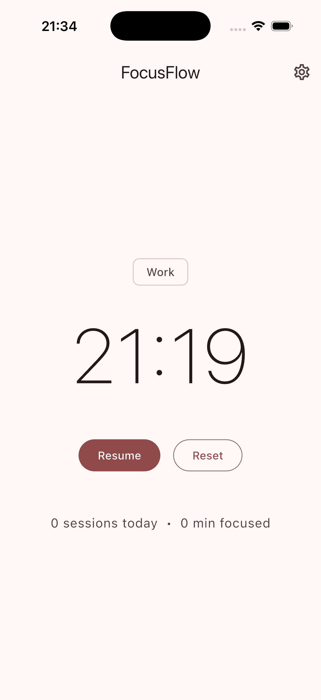
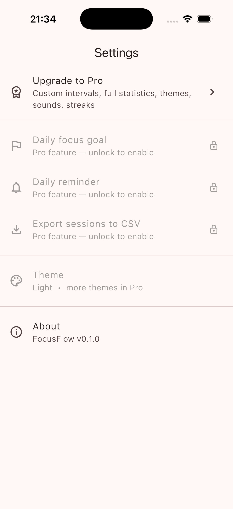

# FocusFlow

A Pomodoro timer with a free tier and a Pro subscription tier. Portfolio project demonstrating Clean Architecture, BLoC/Cubit, Hive persistence, and `in_app_purchase` integration in Flutter.

## Screenshots

| Timer | Settings |
|---|---|
|  |  |

## Features

### Free tier
- 25-minute work / 5-minute short break / 15-minute long break Pomodoro timer
- Cycle progression: work → short break → work → ... → long break every 4th cycle
- Pause / resume / reset, driven by a sealed state machine in `TimerCubit`
- Session persistence via Hive — sessions survive app restarts
- Today's session count and total focus minutes, updated live via box streams
- Completion sound on phase finish (`audioplayers`)
- Light Material 3 theme

### Pro tier
Architecture, IAP integration, and feature implementations are complete. The paywall UI is deferred to Week 3, so in the current build Pro features are gated but not yet user-reachable in-app.

- Subscription via the official `in_app_purchase` plugin: product query, purchase flow, restore-on-launch, `completePurchase` on success
- Entitlement cached in Hive (`EntitlementModel`) for instant Pro state on cold start, then revalidated against Play Billing in the background
- Daily focus goal — configurable slider in Settings; rendered as "3 / 4 sessions today" on the timer page
- Streak tracking with a 24-hour grace day, computed as a pure function from session history
- Daily reminder via `flutter_local_notifications` (inexact alarm; runtime permission requested only when the user enables it)
- CSV export of the full session history (`share_plus` + `path_provider`)
- `ProGate` widget uses `context.select` for granular rebuilds on entitlement changes

## Tech stack

| Concern | Package |
|---|---|
| State management | `flutter_bloc` (Cubit) |
| Value equality | `equatable` |
| Dependency injection | `get_it` |
| Routing | `go_router` (Router 2.0) |
| Local storage | `hive_ce`, `hive_ce_flutter` (community fork of Hive) |
| Code generation | `build_runner`, `hive_ce_generator` |
| In-app purchases | `in_app_purchase` (Google Play Billing) |
| Audio | `audioplayers` |
| Notifications | `flutter_local_notifications`, `timezone` |
| File sharing | `share_plus`, `path_provider` |
| IDs | `uuid` |
| Tests | `flutter_test`, `bloc_test`, `mocktail`, `fake_async` |

`fl_chart` and `intl` are pinned in `pubspec.yaml` but not yet used — reserved for the Pro stats page (weekly bar chart, monthly heatmap) planned for Week 3.

## Architecture

Feature-first Clean Architecture. Each feature owns its own `data/`, `domain/`, and `presentation/` layers. The domain layer is pure Dart with no Flutter and no plugin imports, so business logic is unit-testable without a widget tree.

Key conventions:

- **Entities vs models.** Domain entities (`PomodoroSession`, `Streak`, `Product`, …) are pure Dart with Equatable. Data-layer models (`SessionModel`, `EntitlementModel`) carry `@HiveType` annotations and convert via `fromEntity` / `toEntity`. Persistence choice never leaks into the domain.
- **Sealed state hierarchies for state machines.** `TimerState` has `Initial / Running / Paused / Completed` as sealed subtypes — illegal states (e.g., a Completed state carrying `remaining`) are unrepresentable.
- **Flat state with `copyWith` for parallel-dimension state.** `SubscriptionState` carries entitlement, products list, processing flag, and last error simultaneously — flags fit that shape better than a sealed union.
- **Repository pattern with two implementations.** `FakeSubscriptionRepository` (used in tests and during early development) lives alongside `SubscriptionRepositoryImpl`, which wraps `InAppPurchase.instance`. Swapping them is a one-line change in `injection.dart`.
- **Cubit scopes match lifecycle.** `SubscriptionCubit` and `SettingsCubit` live at the app root because every feature may read entitlement or app settings. `TimerCubit`, `TodayStatsCubit`, and `StreakCubit` are route-scoped so their resources (periodic ticker, stream subscriptions) are cleaned up on navigation.
- **`context.select` over `context.watch`.** `ProGate` rebuilds only when `isPro` flips, not on every product-load or in-flight purchase event.

## Project structure

```
lib/
├── main.dart
├── hive_registrar.g.dart                # generated by hive_ce_generator
├── app/
│   ├── app.dart                         # MaterialApp.router + app-global BlocProviders
│   ├── di/injection.dart                # GetIt registration
│   └── router/app_router.dart           # GoRouter routes
├── core/
│   ├── constants/                       # Hive box names, product IDs
│   ├── services/                        # AudioService, NotificationService
│   ├── theme/                           # Material 3 light theme
│   └── utils/                           # date helpers, duration formatter
└── features/
    ├── timer/
    │   ├── data/{datasources, models, repositories}
    │   ├── domain/{entities, repositories, usecases}
    │   └── presentation/{cubit, pages}
    ├── statistics/
    │   ├── data/repositories
    │   ├── domain/{entities, repositories, usecases}
    │   └── presentation/{cubit, widgets}
    ├── settings/
    │   ├── data/{datasources, repositories}
    │   ├── domain/{entities, repositories, usecases}
    │   └── presentation/{cubit, pages}
    └── subscription/
        ├── data/{datasources, models, repositories}   # Fake + real impl
        ├── domain/{entities, repositories, usecases}
        └── presentation/{cubit, widgets}              # ProGate
```

## Running locally

Prerequisites: Flutter SDK (stable channel, 3.41.x or compatible), Android emulator or connected device, Android SDK.

```bash
git clone https://github.com/nourbagh0-star/FocusFlow.git
cd FocusFlow
flutter pub get
dart run build_runner build       # generates Hive type adapters
flutter run                        # picks the first available device
```

Useful commands:

```bash
flutter analyze        # static analysis (clean on main)
flutter test           # 22 unit + widget tests
flutter build apk      # release APK
```

### Optional: completion sound asset

The free-tier completion sound expects a short `.mp3` at `assets/sounds/bell.mp3`. The app runs fine without it — `AudioService.playCompletionSound()` catches the load error silently, so the timer just plays nothing. See `assets/sounds/README.md` for suggested royalty-free sources.

## Tests

Twenty-two tests across five files:

- `timer_cubit_test.dart` — state transitions, cycle progression, lifecycle (uses `fake_async` for `Timer.periodic`)
- `subscription_cubit_test.dart` — purchase flow against `FakeSubscriptionRepository`
- `stats_repository_streak_test.dart` — streak edge cases (empty / single day / consecutive / gap / grace day / incomplete-ignored / multiple-sessions-same-day)
- `export_sessions_csv_test.dart` — CSV format
- `widget_test.dart` — `TimerPage` initial-state render with mocked Cubits

```bash
flutter test
```

## Status

- **Week 1 — done.** Pomodoro timer, persistence, today stats, audio, settings navigation.
- **Week 2 — done (with one deferral).** Subscription architecture, real `in_app_purchase` integration, Pro features (daily goal, streaks, reminders, CSV export). Paywall UI deferred to Week 3.
- **Week 3 — planned, not started.** Paywall page, custom intervals UI, Pro stats page with `fl_chart`, theme picker, sound picker, Google Play publishing, GitHub Actions CI.

### Deliberate scope cuts

- **No paywall page yet.** The IAP backend is wired end-to-end (query → purchase → grant → cache → restore → acknowledge), but there is no in-app screen for the user to subscribe. Pro features are visible-but-locked in the current build.
- **Client-side IAP only.** No server-side receipt validation — production apps would POST `serverVerificationData` to a backend that calls Google Play Developer API. The integration point is commented in `SubscriptionRepositoryImpl._grantEntitlement`.
- **Android-first.** iOS scaffolding exists but is untested; FocusFlow is targeted at Google Play and RuStore.

## About me

I'm Bagh Nour, a junior Flutter developer with ~3 years of practice and ~1 year of client work. FocusFlow is my second published-style Flutter app.

- GitHub: https://github.com/nourbagh0-star
- Published: [Notes App on RuStore](https://www.rustore.ru/catalog/app/com.example.notes_app) — offline-first note-taking, Hive-backed
